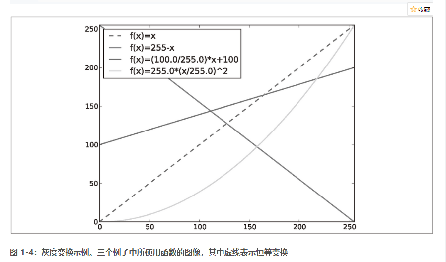

PIL 图片解析

https://blog.csdn.net/u013467442/article/details/41827085

表1-1：Image滤镜参数

|        方法           |      注释             |
|---------------------|---------------------|
|   ImageFilter.BLUR  | 	  模糊滤镜       |
| ImageFilter.CONTOUR |         轮廓         |
|ImageFilter.DETAIL ImageFilter.EDGE_ENHANCE|   边界加强|
|ImageFilter.EDGE_ENHANCE_MORE| 边界加强(阀值更大)|
|ImageFilter.EMBOSS|	浮雕滤镜|
|ImageFilter.FIND_EDGES|	边界滤镜|
|ImageFilter.SMOOTH|	平滑滤镜|
|ImageFilter.SMOOTH_MORE|	平滑滤镜(阀值更大)|
|ImageFilter.SHARPEN|	锐化滤镜|

https://blog.csdn.net/wuxiaobingandbob/article/details/51751899

表1-2：用PyLab库绘图的基本颜色格式命令

| 颜色  |    |
| ------- | --------- |
| 'b' | 蓝色 |
| 'r' | 红色 |
| 'c' | 青色 |
| 'm' | 品红 |
| 'y' | 黄色 |
| 'k' | 黑色 |
| 'w' | 白色 |

表1-3：用PyLab库绘图的基本线型格式命令

|   线型   |      |
| ---- | ---- |
|'-'|实线|
|'--'|虚线|
|':'|点线|

表1-4：用PyLab库绘图的基本绘制标记格式命令

|   标记   |      |
| ---- | ---- |
|'.'|点|
|'o'|圆圈|
|'s'|正方形|
|'*'|星形|
|'+'|加号|
|'x'|叉号|

