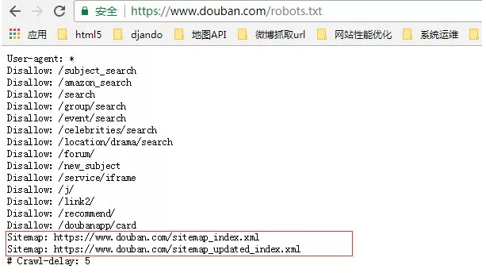
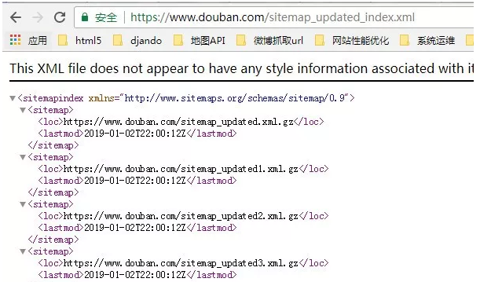
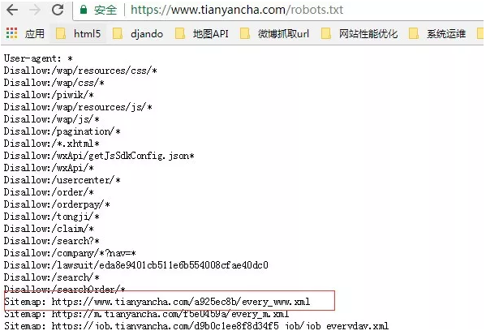
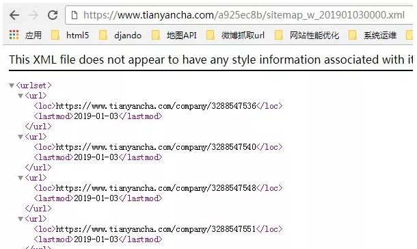

写爬虫有很多苦恼的事情，比如：

1.访问频次太高被限制；

2.如何大量发现该网站的URL；

3.如何抓取一个网站新产生的URL，等等；

这些问题都困扰着爬虫选手，如果有大量离散IP和账号，这些都不是问题，但是绝大部分公司都不具备这个条件的。

我们在工作中写的爬虫大多是一次性和临时性的任务，需要你快速完成工作就好，当遇到上面情况，试着看下robots.txt文件。

**举个栗子**

老板给你布置一个任务，把豆瓣每天新产生的影评，书评，小组帖子，同城帖子，个人日志抓取下来。

初想一下，这任务得有多大，豆瓣有1.6亿注册用户，光是抓取个人日志这一项任务，每个人的主页你至少每天要访问一次。

这每天就得访问1.6亿次，小组/同城帖子等那些还没算在内。

设计一个常规爬虫，靠着那几十个IP是完不成任务的。

#### 初窥robots.txt

当老板给你了上面的任务，靠着你这一两杆枪，你怎么完成，别给老板讲技术，他不懂，他只想要结果。

我们来看下豆瓣的robots.txt

https://www.douban.com/robots.txt

看图片上面红框处，是两个sitemap文件

打开sitemap_updated_index文件看一下：

里面是一个个压缩文件，文件里面是豆瓣头一天新产生的影评，书评，帖子等等，感兴趣的可以去打开压缩文件看一下。

也就是说每天你只需要访问这个robots.txt里的sitemap文件就可以知道有哪些新产生的URL。

不用去遍历豆瓣网站上那几亿个链接，极大节约了你的抓取时间和爬虫设计复杂度，也降低了豆瓣网站的带宽消耗，这是双赢啊，哈哈。

上面通过robots.txt的sitemap文件找到了抓取一个网站新产生URL的偏方。沿着该思路也能解决发现网站大量URL的问题。

#### 举个栗子

老板又给你一个任务，老板说上次抓豆瓣你说要大量IP才能搞定抓豆瓣每天新产生的帖子，这次给你1000个IP把天眼查上的几千万家企业工商信息抓取下来。

看着这么多IP你正留着口水，但是分析网站后发现这类网站的抓取入口很少(抓取入口是指频道页，聚合了很多链接的那种页面)。

很容易就把储备的URL抓完了，干看着这么多IP工作不饱满。

如果一次性能找到这个网站几万乃至几十万个URL放进待抓队列里，就可以让这么多IP工作饱满起来，不会偷懒了。

我们来看他的robots.txt文件：

https://www.tianyancha.com/robots.txt

打开红框处的sitemap，里面有3万个公司的URL，上图是1月3号生成的，那个URL是根据年月日生成的，你把URL改成1月2号，又能看到2号的sitemap里的几万个公司URL，这样就能发现十几万个种子URL供你抓取了。

PS：上面的sitemap其实也能解决抓取天眼查最近更新的，新产生URL的问题。