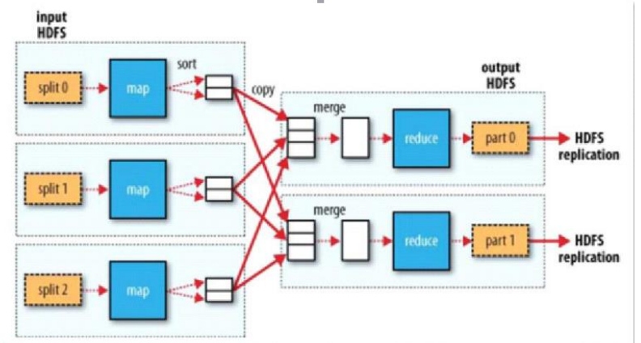
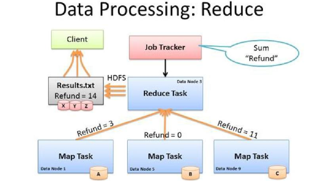
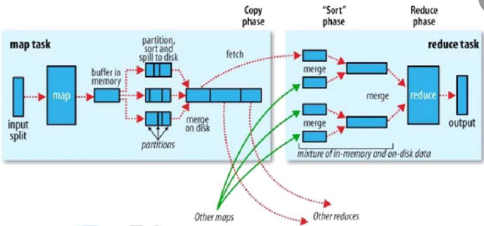

### MapReduce

MapReduce 是一种分布式的离线计算框架，是一种编程模型，用于大规模数据集(大于 1TB)的并行运算。将自己的程序运行在分布式系统上。

概念是："Map(映射)"和"Reduce(归约)"。 指定一个 Map( 映射) ) 函数，用来把一组键值对映射成一组新的键值对，指定并发的Reduce( 归约) ) 函数，用来保证所有映射的键值对中的每一个共享相同的键组。

##### MapReduce设计理念

1-1 分布式计算 分布式计算
		分布式计算将该应用分解成许多小的部分，分配给多台计算机节点进行处理。这样可以节约整体计算时间，大大提高计算效率。

1-2 移动计算

​	它的作用是将有用、准确、及时的信息提供给任何时间、任何地点的任何客户（这里我们说的是将计算程序应用移动到具有数据的集群计算机节点之上进行计算操作）。

##### MapReduce 计算框架的组成


###### Mapper(分)

把得到的复杂的任务分解为若干个“简单的任务”执行。

“简单的任务”有几个含义：
		1、数据或计算规模相对于原任务要大大缩小；
		2、就近计算，即会被分配到存放了所需数据的节点进行计算；
		3、这些小任务可以并行计算，彼此间几乎没有依赖关系。



Split规则：(一个split切片对应一个map)

max(min.split,min(max.split,block))

假设：

​	– max.split(100M)
		– min.split(10M)
		– block(64M)

​		实际=block 大小（方便计算）
		Map 的数目通常是由输入数据的大小决定的，一般就是所有输入文件的总块（block）数


Map在具有需要计算的当前数据的节点上运行（Run this computation on your local data）

拆分的结果落地到本地服务器上：如果落地到hdfs上，首先要通过一次网络IO，然后会保存到多个副本，数据量会变多，并且数据并没有改变。

###### Reduce(合)

(对map阶段进行汇总并输出)

Reducer 的 数 目 由 mapred-site.xml 配 置 文 件 里 的 项 目mapred.reduce.tasks 决定。默认值为 1，用户可以覆盖之。

有多少个Reducd,最终产生的数据文件就有多少份。



Reduce 的数目(设置的都是一个完整的值：整数)建议是：
		用 0.95，所有 reduce 可以在 maps 一完成时就立刻启动，开始传输 map 的输出结果。
		用 1.75，速度快的节点可以在完成第一轮 reduce 任务后，可以开始第二轮，这样可以得到比较好的负载均衡的效果。
		增加 reduce 的数目会增加整个框架的开销，但可以改善负载均衡，降低由于执行失败带来的负面影响。上述比例因子比整体数目稍小一些是为了给框架中的推测性任务（speculative-tasks） 或失败的任务预留一些 reduce 的资源

###### Shuffle(分)

在 mapper 和 reducer 中间的一个步骤，包含于Reduce阶段。

把 mapper 的输出按照某种 key 值重新切分和组合成 n 份，把key 值符合某种范围的输出送到特定的 reducer 那里去处理。

主要是为了简化reducer过程



海量的数据传输进来，被切成一个个的切片，一个切片对应一个map，map在内存运行出来的结果，会有一个内存缓冲区默认100M，按照数据文件进行sort排序（默认字典排序），然后溢写到磁盘，落地到磁盘的时候是有序的，保存到本地的节点上。之后主动的抓取数据Shuffle中，按照相同的任务、key合并，到reduce阶段，进行聚合，形成结果。

##### MapReduce架构

一主多从架构
		–主 JobTracker:（RM）
			负责调度分配每一个子任务 task 运行于 TaskTracker 上，如果发现有失败的 task 

​		就重新分配其任务到其他节点。每一个 hadoop 集群中只有**一个 JobTracker**, 一般它

​		运行在 **Master** 节点上。

​	– 从 TaskTracker:（NM）
			TaskTracker 主动与 JobTracker 通信，接收作业，并负责直接执行每一个任务，为了减少网络带宽 

​		TaskTracker 最好运行在 HDFS 的DataNode 上。


##### MapReduce环境搭建

/home/hadoop-2.6.5/etc/hadoop下

​	mv mapred-site.xml.template mapred-site.xml

​	vim mapred-site.xml

```
<configuration>
	<property>
        <name>mapreduce.framework.name</name>
        <value>yarn</value>
	</property>
</configuration>

```

​	vim yarn-site.xml

```
<property>
	<name>yarn.nodemanager.aux-services</name>
	<value>mapreduce_shuffle</value>
</property>
<property>
	<name>yarn.resourcemanager.ha.enabled</name>
	<value>true</value>
</property>
<property>
	<name>yarn.resourcemanager.cluster-id</name>
	<value>mr_shsxt</value>
</property>
<property>
	<name>yarn.resourcemanager.ha.rm-ids</name>
	<value>rm1,rm2</value>
</property>
<property>
	<name>yarn.resourcemanager.hostname.rm1</name>
	<value>hadoop02</value>
</property>
<property>
	<name>yarn.resourcemanager.hostname.rm2</name>
	<value>hadoop03</value>
</property>
<property>
	<name>yarn.resourcemanager.zk-address</name>
	<value>hadoop01:2181,hadoop02:2181,hadoop03:2181</value>
</property>
```

zkServer.sh start   启动zookeeper

start-all.sh     （This script is Deprecated. Instead use start-dfs.sh and start-yarn.sh）