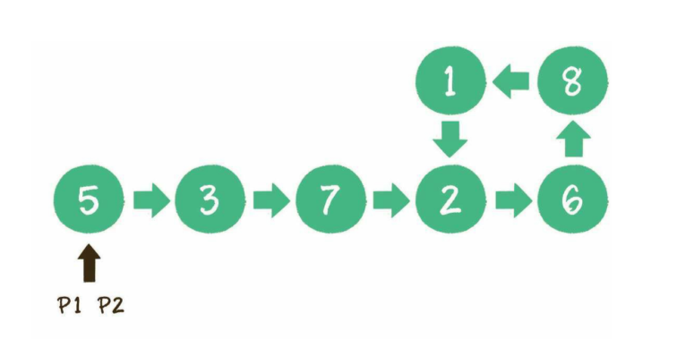
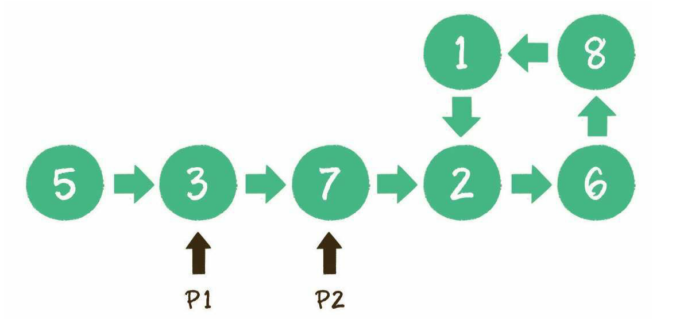
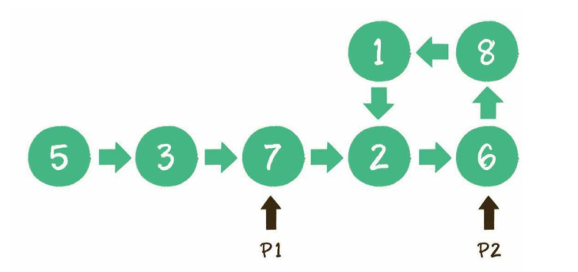
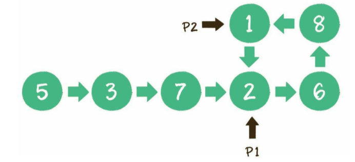
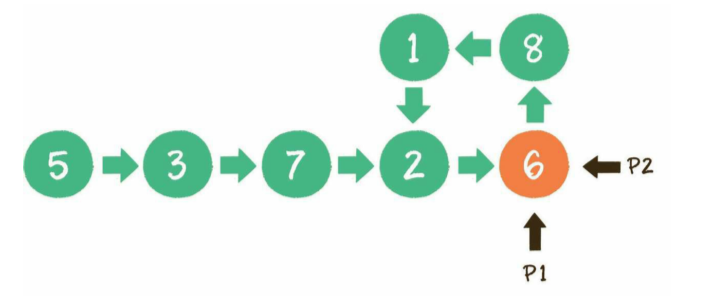
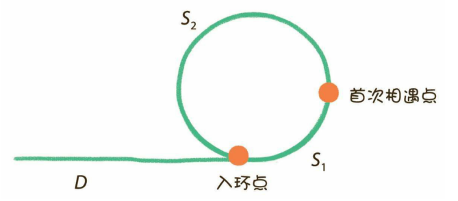

有一个单项链表，怎么判断该链表是否为有环链表


###### 解决

首先创建两个指针p1和p2（在java里就是两个对象引用），让他们同时指向这个链表的头节点。然后开始一个大循环，在循环体中，让p1每次向后移动1个节点，让指针p2每次向后移动两个节点，比较两个指针指向的节点是否相同，如果相同，则可以判断出链表有环，如果不同，继续下一次循环

1. p1和p2都指向节点5

   

2. p1指向节点3，p2指向节点7

   

3. p1指向节点7，p2指向节点6

   

4. p1指向节点p2，p2指向节点1

   

5. p1指向节点6，p2也指向节点6，p1和p2所指向相同，说明链表有环

   

因为链表的节点数量为n，则该时间复杂度为`O(n)`，空间复杂度为`O(1)`

###### 代码

```java
import java.util.*;

public class uxdl {
    /*
    * 判断是否有环
    * @param head 链表头节点
    * */
    public static boolean isCycle(Node head){
        Node p1 = head;
        Node p2 = head;
        while (p2 != null &&p2.next != null){
            p1 = p1.next;
            p2 = p2.next.next;
            if (p1 == p2){
                return true;
            }
        }
        return false;
    }

    /*
    * 链表节点
    * */
    private static class Node{
        int data;
        Node next;
        Node(int data){
            this.data = data;
        }
    }
    public static void main(String[] args) throws Exception{
        Node node1 = new Node(5);
        Node node2 = new Node(3);
        Node node3 = new Node(7);
        Node node4 = new Node(2);
        Node node5 = new Node(6);
        node1.next = node2;
        node2.next = node3;
        node3.next = node4;
        node4.next = node5;
        node5.next = node2;

        System.out.println(isCycle(node1));
    }
}

```

######扩展

1. 如果链表有环，如何求出环的长度？

   当两个指针首次相遇，证明链表有环的时候，让两个指针从相遇点继续循环前进，并统计前进的循环次数，直到两个指针第二次相遇。此时，统计出来的前进次数就是环长。

   因为指针p1每次走1步，指针p2每次走两步，两者的速度差是1步。当两个指针再次相遇时，p2比p1多走了整整一圈。

   因此，环长 = 每一次速度差 × 前进次数 = 前进次数

2. 如果链表有环，如何求出入环节点？

   

   上图是对有环链表所做的一个抽象示意图。假设从链表头节点到入环点到两个指针首次相遇点的距离是S1，从首次相遇点回到入环点的距离是S2.

   那么，当两个指针首次相遇时，各自所走的距离是多少呢？

   指针p1一次只走1步，所走的距离是D+S1。

   指针p2一次走2步，多走了n (n>=1)整圈，所走的距离是D+S1+n(S1+S2)

   由于p2的速度是p1的2倍，所以所走的距离也是p1的2倍，因此：

   ​	2(D + S1) = D + S1+ n(S1+S2) => D = (n - 1)(S1 + S2) + S2

   也就是说，从链表头节点到入环点的距离等于从首次相遇点绕环n-1圈再回到入环点的距离。

   这样一来，只要把其中一个指针放回头节点的位置，另一个指针保持在首次相遇点，两个指针都是每次向前走1步，那么，他们最终相遇的节点就是入环节点。

   

   

   

