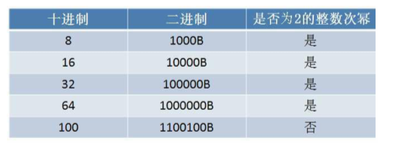
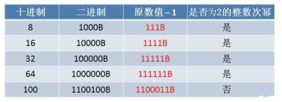
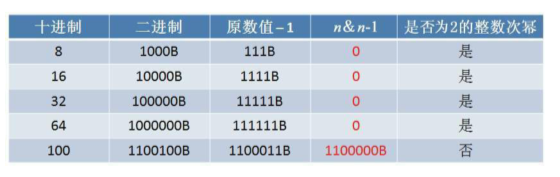

实现一个方法，来判断一个正整数是否是2的整数次幂（16是2的4次方，返回true，18不是2的整数幂，则返回false）。

如果一个整数是2的整数次幂，那么当它转化成二进制时，只有最高位是1，其他都是0



如果把这些2的整数次幂各自减1，在转化成二进制



如果用原数值（2的整数次幂）和它减1的结果进行按位与运算，也就是`n&(n-1)`



```java
public static boolean isPowerOf2(int num){
	return (num&num-1) == 0;
}
```

