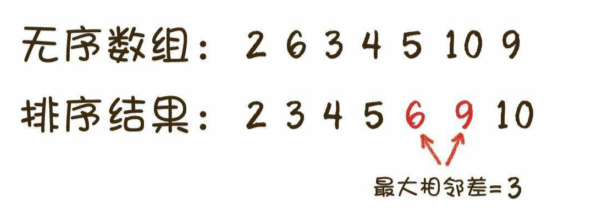
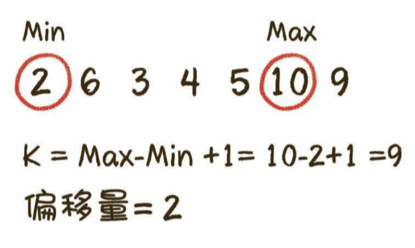
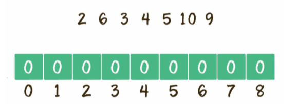
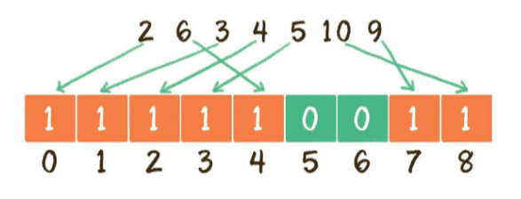
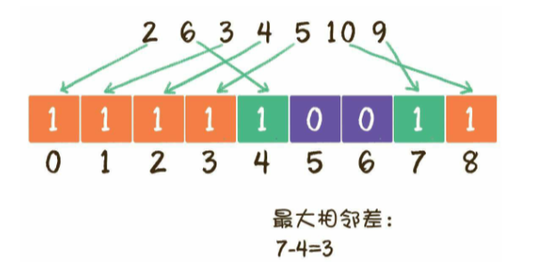

有一个无序整型数组，如何求出该数组排序后的任意两个相邻元素的最大值？要求时间和空间复杂度大尽可能的低



###### 几种解法

1. 先排序，再比较大小

2. 计数排序的思想

   - 利用计数排序的思想，先求出原数组的最大值max和最小值min的区间长度k（k=max-min+1），以及偏移量d=min
   - 创建一个长度为k的新数组Array
   - 遍历原数组，每遍历一个元素，就把新数组Array对应下标的值+1。例如原数组元素的值为m，则将`Array[n-min]`的值加1，遍历结束后，Array的一部分元素值就变成了1或者更高的数值，一部分元素值仍然为0
   - 遍历新数组Array，统计Array中最大连续出现0值的次数+1，即为相邻元素的最大差值。

   给定一个无序数组,`{2, 6, 3, 4, 5, 10, 9}`处理过程如下：

   1. 确定k（数组长度）和d（偏移量）

      

   2. 创建数组

      

   3. 遍历原数组，对号入座

      

   4. 判断0值最多连续出现的次数，计算出最大相邻差

      

3. 同样的，计数排序的优化，也可以适用于上述排序，利用桶排序的思想

   1. 根据原数组的长度n，创建出n个桶，每一个桶代表一个区间范围。其中第1个桶从原数组的最小值min开始，区间跨度是`(max-min)/(n-1)`
   2. 遍历原数组，把原数组每一个元素插入到对应的桶中，记录每一个桶的最大和最小值
   3. 遍历所有的桶，统计出每一个桶的最大值和这个桶右侧非空桶的最小值的差，数值最大的差即为原数组排序后的相邻最大差值

   ```java
   public class uxdl {
       public static int getMaxSortedDistance(int[] array) {
           // 1.得到数列的最大值和最小值
           int max = array[0];
           int min = array[0];
           for (int i = 1; i < array.length; i++) {
               if (array[i] > max) {
                   max = array[i];
               }
               if (array[i] < min) {
                   min = array[i];
               }
           }
           int d = max - min;
           // 如果max 和min 相等，说明数组所有元素都相等，返回0
           if (d == 0) {
               return 0;
           }
   
           // 2.初始化桶
           int bucketNum = array.length;
           Bucket[] buckets = new Bucket[bucketNum];
           for (int i = 0; i < bucketNum; i++) {
               buckets[i] = new Bucket();
           }
   
           // 3.遍历原始数组，确定每个桶的最大最小值
           for (int i = 0; i < array.length; i++) {
               // 确定数组元素所归属的桶下标
               int index = ((array[i] - min) * (bucketNum - 1) / d);
               if (buckets[index].min == null || buckets[index].min > array[i]) {
                   buckets[index].min = array[i];
               }
               if (buckets[index].max == null || buckets[index].max < array[i]) {
                   buckets[index].max = array[i];
               }
           }
   
           // 4.遍历桶，找到最大差值
           int leftMax = buckets[0].max;
           int maxDistance = 0;
           for (int i = 1; i < buckets.length; i++) {
               if (buckets[i].min == null) {
                   continue;
               }
               if (buckets[i].min - leftMax > maxDistance) {
                   maxDistance = buckets[i].min - leftMax;
               }
               leftMax = buckets[i].max;
           }
           return maxDistance;
       }
   
       /*
        * 桶
        * */
       private static class Bucket {
           Integer min;
           Integer max;
       }
   
       public static void main(String[] args) {
           int[] array = new int[]{2, 6, 3, 4, 5, 10, 9};
           System.out.println(getMaxSortedDistance(array));
       }
   }
   ```

   