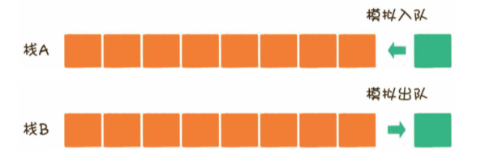
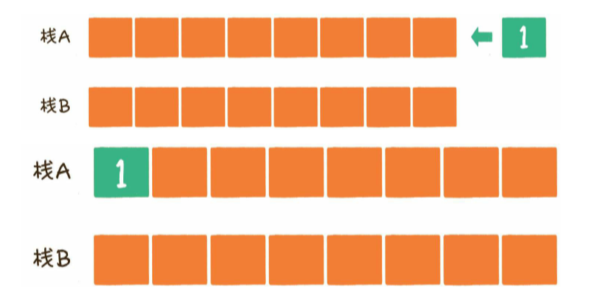
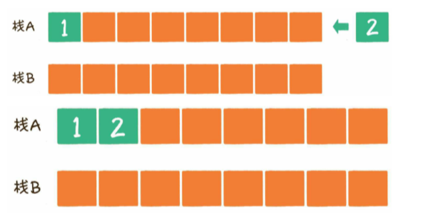
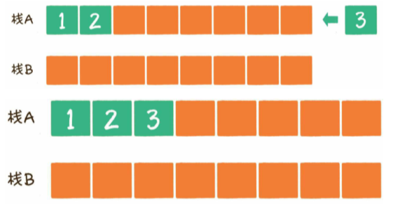
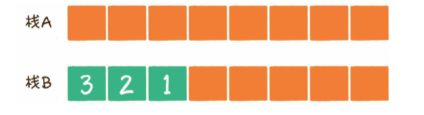

用栈来模拟一个队列，要求实现队列的两个基本操作：入队、出队

提示：用两个栈实现


##### 解

有两个栈，可以让其中一个栈作为队列的入口，负责插入新元素；另外一个栈作为队列的出口，负责移除老元素。

###### 入队



让元素1入队



让元素2入队



让元素3入队



###### 出队

出队的时候，让栈A中的所有元素按顺序出栈，再按照出栈顺序压入栈B。这样一来，元素从栈A弹出并压入栈B的顺序是3、2、1，和当初进入栈A的顺序1、2、3是相反的。



```java
private Stack<Integer> stackA = new Stack<Integer>();
    private Stack<Integer> stackB = new Stack<Integer>();

    /*
    * 入队操作
    * @param element 入队元素
    * */
    public void enQueue(int element){
        stackA.push(element);
    }

    /*
    * 出队操作
    * */
    public Integer deQueue(){
        if (stackB.isEmpty()){
            if (stackA.isEmpty()){
                return null;
            }
            transfer();
        }
        return stackB.pop();
    }

    /*
    * 栈A元素转移到栈B
    * */
    private void transfer() {
        while (!stackA.isEmpty()){
            stackB.push(stackA.pop());
        }
    }
```

入队时间复杂度是`O(1)`.

均摊时间复杂度：把时间均摊到每一次出队操作上面，其时间复杂度是`O(1)`

