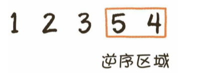
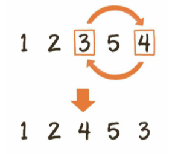
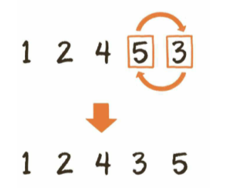

给出一个正整数，找出这个正整数所有数字全排列的下一个数。

通俗点说就是在一个整数所包含数字的全部组合中，找出一个大于且仅大于原数的新整数

例如

​	输入12345，则返回12354

​	输入12354，则返回12435

​	输入12435，则返回12453


由固定的几个数字组成的整数，逆序排列的情况下最大，顺序排列的情况下最小。

为了和原数接近，我们需要尽量保持高位不变，低位在最小的范围内变换顺序。

至于变换顺序的范围大小，则取决于当前整数的逆序区域。



如图所示，12354的逆序区域是最后两位，仅看这两位已经是当前最大的组合。若想最接近原数，又比原数更大，必须从倒数第三位开始改变。我们需要从后面的逆序区域中找到大于3的最小数字，让其和3的位置进行互换。



互换后的临时结果是12453，倒数第3位已经确定，这个时候最后两位仍然是逆序状态，我们需要把最后两位转变为顺序状态，以此保证在倒数第三位数值为4的情况下，后两位尽可能小。



获得全排列下一个数的3个步骤

1. 从后向前查看逆序区域，找到逆序区域的前一位，也就是数字置换的边界
2. 让逆序区域的前一位和逆序区域中大于它的最小数字交换位置
3. 把原来的逆序区域转为顺序状态

```java
import java.util.Arrays;

public class uxdl {
    public static int[] findNearestNumber(int[] numbers) {
        // 1.从后向前查看逆序区域，找到逆序区域的前一位，也就是数字置换的边界
        int index = findTransferPoint(numbers);
        // 如果数字置换边界是0，说明整个数组已经逆序，无法得到更大的相同数字组成的整数，返回null
        if (index == 0) {
            return null;
        }
        // 2.把逆序区域的前一位和逆序区域中刚刚大于它的数字交换位置
        // 复制并入参，避免直接修改入参
        int[] numbersCopy = Arrays.copyOf(numbers, numbers.length);
        exchangeHead(numbersCopy, index);
        // 3.把原来的逆序区域转为顺序
        reverse(numbersCopy, index);
        return numbersCopy;
    }

    private static int findTransferPoint(int[] numbers) {
        for (int i = numbers.length - 1; i > 0; i--) {
            if (numbers[i] > numbers[i - 1]) {
                return i;
            }
        }
        return 0;
    }

    private static int[] exchangeHead(int[] numbers, int index) {
        int head = numbers[index - 1];
        for (int i = numbers.length - 1; i > 0; i--) {
            if (head < numbers[i]) {
                numbers[index - 1] = numbers[i];
                numbers[i] = head;
                break;
            }
        }
        return numbers;
    }
    private static int[] reverse(int[] num, int index){
        for(int i=index, j=num.length-1; i<j; i++, j--){
            int temp = num[i];
            num[i] = num[j];
            num[j] = temp;
        }
        return num;
    }
    public static void main(String[] args){
        int[] numbers = {1,2,3,4,5};
        // 打印12345 之后的10个全排列整数
        for (int i=0; i<10; i++){
            numbers = findNearestNumber(numbers);
            outputNumbers(numbers);
        }
    }

    // 输出数组
    private static void outputNumbers(int[] numbers){
        for (int i: numbers){
            System.out.print(i);
        }
        System.out.println();
    }
}

```

时间复杂度：`O(n)`