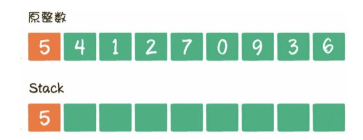
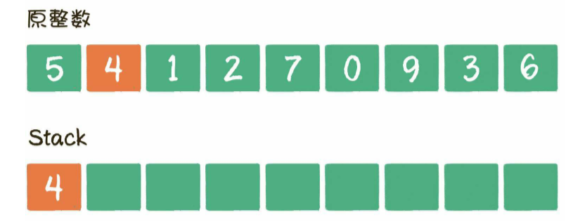
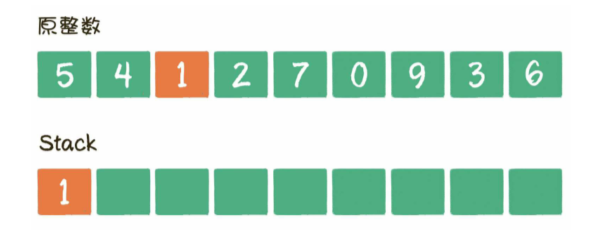
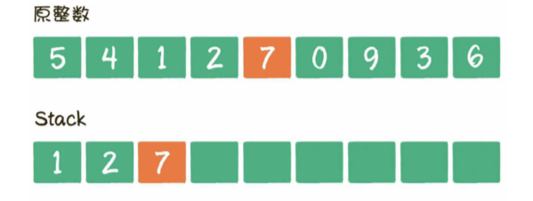
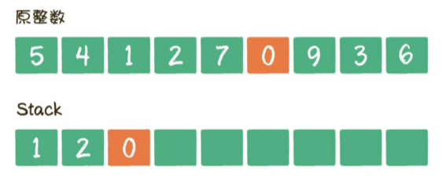
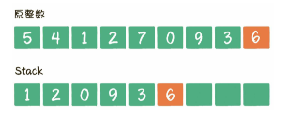

给出一个整数，从该整数中去掉k个数字，要求剩下的数字形成的新整数尽可能小。应该如何选择去掉的数字。

假设给出一个整数1593212，删去3个数字，新整数最小的情况是1212

假设给出一个整数30200，删去1个数字，新整数最小的情况是200

假设给出一个整数10，删去2个数字，新整数最小的情况是0

###### 思路

- 给出一个整数541270936，要求删去1个数字，让剩下的整数尽可能小。

  此时无论删除哪一个数字，最后的结果都是从9位整数，变成8位整数。既然同样是8位整数，显然应该优先把高位数字降低，这样对新整数的值影响最大

  数字5右侧数字4小于5，所以删除5，最高位数字降低成了4

- 对41270936继续做删除

  删除4，因为4是第一个比右侧数字大的数 4>1

- 对1270936继续做删除

  因为1<2，2<7，7>0，所以被删除的数字应该是7

- 所以删除k(k=3)个数字后的最小值是120936

这样依次求得局部最优解，最终得到的全局最优解的思想叫做贪心算法。

###### 代码

```java
import java.util.Arrays;

public class uxdl {
    public static String removeKDigits(String num, int k){
        String numNew = num;
        for (int i=0; i<k; i++) {
            boolean hasCut = false;
            // 从左向右遍历，找到比自己右侧数字大的数字并删除
            for (int j=0; j<numNew.length() -1; j++){
                if (numNew.charAt(j) > numNew.charAt(j+1)){
                    numNew = numNew.substring(0, j) + numNew.substring(j+1, numNew.length());
                    hasCut = true;
                    break;
                }
            }
            // 如果没有找到要删除的数字，则删除最后一个数字
            if (!hasCut){
                numNew = numNew.substring(0, numNew.length() - 1);
            }
            // 清除整数左侧的数字0
            numNew = removeZero(numNew);
        }
        // 如果整数的所有数字都被删除了，直接返回0
        if (numNew.length() == 0){
            return "0";
        }
        return numNew;
    }

    private static String removeZero(String num){
        for (int i=0; i<num.length()-1; i++){
            if (num.charAt(0) != '0'){
                break;
            }
            num = num.substring(1, num.length());
        }
        return num;
    }
    public static void main(String[] args){
        System.out.println(removeKDigits("1593212", 3));
        System.out.println(removeKDigits("30200", 1));
        System.out.println(removeKDigits("10", 2));
        System.out.println(removeKDigits("541270936", 3));
    }
}

```

时间复杂度`O(kn)`，subString本身的时间复杂度是`O(n)`

###### 优化

```java
import java.util.Arrays;

public class uxdl {
    public static String removeKDigits(String num, int k) {
        // 新整数的最终长度 = 原整数长度 - k
        int newLength = num.length() - k;
        // 创建一个栈，用于接收所有数字
        char[] stack = new char[num.length()];
        int top = 0;
        for (int i = 0; i < num.length(); ++i) {
            // 遍历当前数字
            char c = num.charAt(i);
            // 当栈顶数字大于遍历到当前的数字时，栈顶数字出栈（相当于删除数字）
            while (top > 0 && stack[top - 1] > c && k > 0) {
                top -= 1;
                k -= 1;
            }
            // 遍历到当前数字入栈
            stack[top++] = c;
        }
        // 找到栈中第一个非零数字的位置，以此构建新的整数字符串
        int offset = 0;
        while (offset < newLength && stack[offset] == '0') {
            offset++;
        }
        return offset == newLength ? "0" : new String(stack, offset, newLength);
    }

    public static void main(String[] args) {
        System.out.println(removeKDigits("1593212", 3));
        System.out.println(removeKDigits("30200", 1));
        System.out.println(removeKDigits("10", 2));
        System.out.println(removeKDigits("541270936", 3));
    }
}

```

上面很巧妙的运用了栈的特性，在遍历原整数的数字时，让所有数字一个一个入栈，当某个数字需要删除时，让该数字出栈。最后程序把栈中的元素转化为字符串类型的结果。

下面仍然以整数541270936，k=3为例

当遍历到数字5时，数字5入栈。



当遍历到数字4时，发现栈顶5>4，栈顶5出栈，数字4入栈



当遍历到数字1时，发现4>1，栈顶4>1，栈顶4出栈，数字1入栈



然后继续遍历数字2、数字7，并依次入栈



最后，遍历数字0，发现栈顶7>0，栈顶7出栈，数字0入栈



此时k的次数已经用完，无须再比较，让剩下的数字一起入栈即可



最终的时间复杂度是`O(n)`，空间复杂度也是`O(n)`