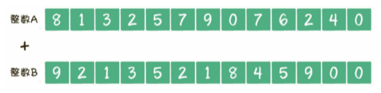
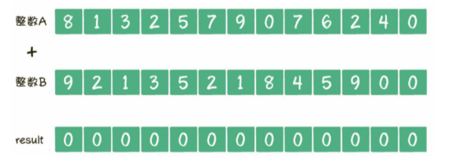
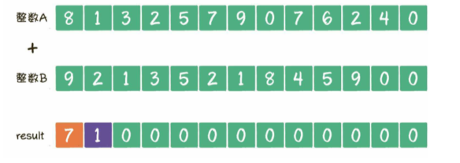
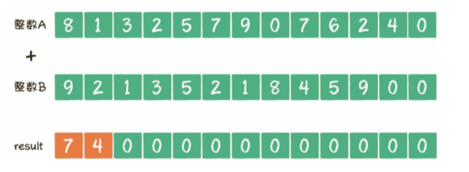

给出两个很大的整数，要求程序求出两个整数之和

###### 思路

以426709752318+95481253129为例

1. 创建两个数组，数组长度是较大的整数位数+1，把每一个整数倒序存储到数组中，整数的个位存于数组下标为0的位置，最高位存于数组的尾部。之所以倒序存储，是因为这样更符合从左到右访问数组的习惯。

   

2. 创建结果数组，结果数组的长度同样是较大的整数位数+1，+1的目的很明显，是给最高位进位预留的

   

3. 遍历两个数组，从左到右按照对应下标把元素两两相加

   在本示例中，最先相加的是数组A的第1个元素8和数组B的第一个元素9，结果是7，进位1，把7填充到result数组的对应下标位置，进位的1填充到下一个位置。

   

4. 第二组相加的是数组A的第2个元素1和数组B的第二个元素2，结果是3，再加上刚才的进位1，把4填充到result数组的对应下标位置。

   

###### 代码

```java
import java.util.Arrays;

public class uxdl {
    /*
     * 大整数求和
     * @param bigNumberA 大整数A
     * @param bigNumberB 大整数B
     * */
    public static String bigNumberSum(String bigNumberA, String bigNumberB) {
        //1. 把两个大整数用数组逆序存储，数组长度等于较大整数位数+1
        int maxLength = bigNumberA.length() > bigNumberB.length() ? bigNumberA.length() : bigNumberB.length();

        int[] arrayA = new int[maxLength + 1];
        for (int i = 0; i < bigNumberA.length(); i++) {
            arrayA[i] = bigNumberA.charAt(bigNumberA.length() - 1 - i) - '0';
        }
        int[] arrayB = new int[maxLength + 1];
        for (int i = 0; i < bigNumberB.length(); i++) {
            arrayB[i] = bigNumberB.charAt(bigNumberB.length() - 1 - i) - '0';
        }
        // 2.构建result数组，数组长度等于较大整数位数+1
        int[] result = new int[maxLength + 1];
        // 3.遍历数组，按位相加
        for (int i = 0; i < result.length; i++) {
            int temp = result[i];
            temp += arrayA[i];
            temp += arrayB[i];
            // 判断是否进位
            if (temp >= 10) {
                temp = temp - 10;
                result[i + 1] = 1;
            }
            result[i] = temp;
        }
        // 4.把result数组再次逆序并转成String
        StringBuilder sb = new StringBuilder();
        // 是否找到最大整数的最高有效位
        boolean findFirst = false;
        for (int i = result.length - 1; i >= 0; i--) {
            if (!findFirst) {
                if (result[i] == 0) {
                    continue;
                }
                findFirst = true;
            }
            sb.append(result[i]);
        }
        return sb.toString();
    }

    public static void main(String[] args) {
        System.out.println(bigNumberSum("5463546435131685646", "45634135435186413528645"));
    }
}

```

如果给出的大整数的最长位数是n，那么创建数组、按位计算、结果逆序的时间复杂度各自都是`O(n)`，整体的时间复杂度也是`O(n)`

###### 优化

我们不需要将数字中的每一位都拆开来进行10以内的加减，只需要拆分到可以被直接计算的程度就可以了。

int类型的取值范围是`-2147483648~2147483647`，最多可以有10位整数，为了防止溢出，我们可以把大整数的每9位作为一个数组进行加法运算。


如此一来，内存占用空间和运算次数都压缩到了原来的1/9

java中，工具类`BigInteger`和`BigDecimal`的底层实现同样是把大整数拆分成数组进行运算，和这个思路大体类似