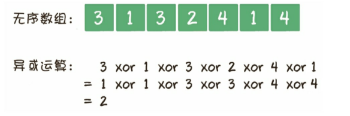
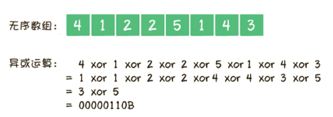

在一个无序数组里有99个不重复的正整数，范围是1~100，唯独缺少了一个1~100中的整数，如何找出这个整数？


###### 解法

- 创建一个哈希表，以1到100这100个整数为key，然后遍历整个数组，每读到一个整数，就定位到哈希表中对应的key，然后删除这个key

  时间复杂度是`O(n)`，空间复杂度是`O(n)`

- 先把数组元素从小到大进行排序，然后遍历已经有序的数组，如果发现某两个相邻的元素不连续，说明缺少的就是这两个元素之间的整数

  使用时间复杂度为`O(nlogn)`的排序算法进行排序，那么该解法的时间复杂度是`O(nlogn)`，空间复杂度是`O(1)`

- 先算出1~100的累加和，然后依次减去数组中所有的元素，最后的差值就是所缺少的整数

  时间复杂度`O(n)`，空间复杂度`O(1)`

###### 扩展

- 一个无序数组中有若干个正整数，范围是1~100，其中99个整数都出现了偶数次，只有1个整数出现了奇数次，如何找到这个出现奇数次的整数

  解法：

  遍历整个数组，依次做异或运算，由于异或运算在进行位运算时，相同为0，不同为1，因此所有出现偶数次的整数都会互相抵消变成0，只有唯一出现奇数次的整数会被留下。

  

  时间复杂度是`O(n)`，空间复杂度是`O(1)`

- 一个无序数组中有若干个正整数，范围是1~100，其中98个整数都出现了偶数次，只有2个整数出现了奇数次，如何找到这2个出现奇数次的整数？

  解法：

  把2个出现了奇数次的整数命名为A和B。遍历整个数组，然后依次做异或运算，进行异或的最终结果等同于A和B进行异或运算的结果。在这个结果中，至少会有一个二进制位是1（都是0说明A和B相等）

  举个例子`{4,1,2,2,5,1,4,3}` 所有元素进行异或运算的结果是`00000110B`

  

  选定该结果中值为1的某一位数字，如`00000110B`的倒数第二位是1，说明A和B对应的二进制的倒数第2位是不同的，其中必定有一个整数的倒数第二位是0，另一个整数的倒数第二位是1

  根据这个结论，可以把原数组按照二进制的倒数第2位的不同，分为两部分，一部分的倒数第二位是0，另一部分倒数第2位是1。由于A和B的倒数第二位不同，所以A被分配到了其中一部分，B在另一部分。

  这样就按照上面的解法，用异或找出每一部分唯一的奇数次整数。

  ```java
  public class uxdl {
      public static int[] findLostNum(int[] array) {
          // 用于存储2个出现奇数次的整数
          int result[] = new int[2];
          // 第1次进行整体异或运算
          int xorResult = 0;
          for (int i = 0; i < array.length; i++) {
              xorResult ^= array[i];
          }
          // 如果进行异或运算的结果为0，则说明输入的数组不符合题目要求
          if (xorResult == 0) {
              return null;
          }
          // 确定2个整数的不同位，以此来做分组
          int separator = 1;
          while (0 == (xorResult & separator)) {
              separator <<= 1;
          }
          // 第2次分组进行异或运算
          for (int i = 0; i < array.length; i++) {
              if (0 == (array[i] & separator)) {
                  result[0] ^= array[i];
              } else {
                  result[1] ^= array[i];
              }
          }
          return result;
      }
  
      public static void main(String[] args) {
          int[] array = {4, 1, 2, 2, 5, 1, 4, 3};
          int[] result = findLostNum(array);
          System.out.println(result[0] + ", " + result[1]);
      }
  }
  
  ```

  