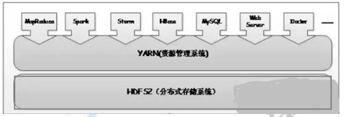

## Hadoop2.x

Hadoop1.x存在的问题：

Ø  单点故障：主从架构的通病：一旦NameNode出现故障，整个集群瘫痪

Ø  单节点由于数据量的增加，NameNode压力过大，且内存受限，影响系统扩展性

Ø  MapReduce 存在的问题：JobTracker 访问压力大，影响系统扩展性，难以支持除 MapReduce 之外的计算框架，比如 Spark、Storm 等.

相比hadoop1.x：

​		1、解决单点故障
				HDFS HA：通过主备 NameNode 解决，如果主 NameNode 发生故障，则切换到备 NameNode 上
			2、解决内存受限问题

​			HDFS Federation（联邦机制）、 HA
				支持 2 个节点的 HA（3.0 实现了一主多从）
				水平扩展，支持多个 NameNode；
				每个 NameNode 分管一部分目录；
				所有 NameNode 共享所有 DataNode 存储资源

### HDFS2.0高可用


启动时，存放数据的多个DN向两个NN（状态不同，Active状态的才对外提供读写信息）汇报信息，JN使得主备NN之前的数据共享（元数据信息），Active状态的NN 会的把DN的元数据信息发送给JN（过半机制：保证元数据信息的安全）保存下来，之后StandbyNN会**主动**的把元数据信息同步到自己本地，如果ActiveNN出现故障，StandbyNN可以瞬间接管，这样不会影响集群的安全。zookeeper集群通过**分布式的进程锁**来判断NN的实时状态，获得了进程锁的NN会变成Active状态

#### JN 实现主备 NN 间的数据共享

主备 NameNode
	解决单点故障
	主 NameNode 对外提供服务，备 NameNode 同步主 NameNode 元数据，以待切换,所有 DataNode 同时向两个 NameNode 汇报数据块位置信息
	两种切换选择

- 手动切换：通过命令实现主备之间的切换，可以用 HDFS 升级等场合（一般不用）
- **自动切换**：基于 Zookeeper 实现

基于 Zookeeper 自动切换方案

### Zookeeper

### Yarn(扩展系统配置)

Yarn的引入使得多个框架可以运行在一个集群中，每个应用程序对应一个 ApplicationMaster



核心思想：将 MRv1 中 JobTracker 的资源管理和任务调度两个功能分开，分别由 ResourceManager 和 ApplicationMaster 进程实现。

ResourceManager： 负责整个集群的资源管理和调度。
	ApplicationMaster（具体的程序）：负责应用程序相关的事务，比如任务调度、任务监控和容错等。

##### Yarn运行原理


提交任务---发送请求到ResourceManager(资源管理)用来请求启动AppMaster---RM根据请求到对应的服务器上启动AppMas-----NodeManager（DataNode的代理）用来启动AppMas，把任务真正的启动起来-------

​	1、向RM请求资源Container（内存、线程、CPU核心数）------进程线程去执行 -----向RM反向注册：提交任务进度（ResourceManager实时掌握任务进行情况）

​	2、数据分布在不同的DataNode，根据不同的DM申请Container,AppMas连接DM用来启动程序(每个DM上都会申请一个Container)-----向RM反向注册：提交任务进度（ResourceManager实时掌握任务进行情况）

```
	client 客户端向 yarn 集群(resourcemanager)提交任务

	resourcemanager 选择一个 node 创建 appmaster

	appmaster 根据任务向 rm 申请资源

	rm 返回资源申请的结果

	appmaster 去对应的 node 上创建任务需要的资源（container 形式，包括内存和CPU）

	appmaster 负责与 nodemanager 进行沟通，监控任务运行

	最后任务运行成功，汇总结果。

	其中 Resourcemanager 里面一个很重要的东西，就是调度器 Scheduler，调度规则可以使用官方提供的，也可以自定义

```

### Hadoop2.x环境搭建

##### 准备：

|        |  NN  |  JN  |  ZK  |  DN  | ZKFC |
| :----: | :--: | :--: | :--: | :--: | :--: |
| Node01 |  √   |      |  √   |      |  √   |
| Node02 |  √   |  √   |  √   |  √   |  √   |
| Node03 |      |  √   |  √   |  √   |      |
| Node04 |      |  √   |      |  √   |      |

Zookeeper Failover Controller：监控 NameNode 健康状态，并向 Zookeeper注册 NameNode，NameNode 挂掉后，ZKFC 为 NameNode 竞争锁，获得 ZKFC 锁的NameNode 变为 active

ZKFC必须和NameNode一致

##### 开始：

###### 1、下载并解压缩Hadoop

​		tar -zxvf hadoop-2.6.5.tar.gz

###### 2、在Hadoop中配置JDK环境

​		/home/hadoop-2.6.5/etc/hadoop/hadoop-env.sh

​		export JAVA_HOME=/usr/java/jdk1.7.0_67

###### 3、/home/hadoop-2.6.5/etc/hadoop/cor-site.xml

```
<configuration>
	<property>
		<name>fs.defaultFS</name>
		<value>hdfs://sen</value>
	</property>
	<property>
		<name>ha.zookeeper.quorum</name>
		<value>hadoop01:2181,hadoop02:2181,hadoop03:2181</value>
	</property>
	<property>
		<name>hadoop.tmp.dir</name>
		<value>/opt/hadoop</value>
	</property>
</configuration>
```

###### 4、/home/hadoop-2.6.5/etc/hadoop/hdfs-site.xml

```
<configuration>
	<property>
		<name>dfs.nameservices</name>   ---工作空间
		<value>sen</value>
	</property>
	<property>
		<name>dfs.ha.namenodes.sen</name>
		<value>nn1,nn2</value>
	</property>
	<property>
		<name>dfs.namenode.rpc-address.sen.nn1</name>
		<value>hadoop01:8020</value>
	</property>
	<property>
		<name>dfs.namenode.rpc-address.sen.nn2</name>
		<value>hadoop02:8020</value>
	</property>
	<property>
		<name>dfs.namenode.http-address.sen.nn1</name>
		<value>hadoop01:50070</value>
	</property>
	<property>
		<name>dfs.namenode.http-address.sen.nn2</name>
		<value>hadoop02:50070</value>
	</property>
	<property>
		<!-- 指定namenode元数据存储在journalnode中的路径 -->
		<name>dfs.namenode.shared.edits.dir</name>
		<value>qjournal://hadoop01:8485;hadoop02:8485;hadoop03:8485/sen</value>
	</property>
	<property>
		<!-- 指定HDFS客户端连接active namenode的java类 -->
		<name>dfs.client.failover.proxy.provider.sen</name>										<value>org.apache.hadoop.hdfs.server.namenode.ha.ConfiguredFailoverProxyProvider</value>
	</property>
	<property>
		<!-- 配置隔离机制为ssh 防止脑裂 -->
		<name>dfs.ha.fencing.methods</name>
		<value>sshfence</value>
	</property>
	<property>
		<!-- 指定秘钥的位置 -->
		<name>dfs.ha.fencing.ssh.private-key-files</name>
		<value>/root/.ssh/id_dsa</value>
	</property>
	<property>
		<!-- 指定journalnode日志文件存储的路径 -->
		<name>dfs.journalnode.edits.dir</name>
		<value>/opt/hadoop/data</value>
	</property>
	<property>
		<!-- 开启自动故障转移 -->
		<name>dfs.ha.automatic-failover.enabled</name>
		<value>true</value>
	</property>
</configuration>
```

###### 5、在/home/hadoop-2.5.1/etc/hadoop/slaves 文件中

```
hadoop01
hadoop02
hadoop03
```

###### 6、配置zookeeper

解压

​	tar -zxvf zookeeper-3.4.6.tar.gz 

cd  /home/zookeeper-3.4.6/conf

​	mv zoo_sample.cfg zoo.cfg

​	vim zoo.cfg（修改）

```
------------------------------修改或添加--------------------------------
tickTime=2000      ------发送心跳的间隔时间，单位：毫秒
dataDir=/opt/zookeeper

添加
server.1=hadoop01:2888:3888
server.2=hadoop02:2888:3888
server.3=hadoop03:2888:3888

----------------------------------解释----------------------------------
clientPort=2181 客户端端口号，Zookeeper 会监听这个端口，接受客户端的访问请求。
initLimit=5
syncLimit=2
server.1=node01:2888:3888
server.2=node02:2888:3888
server.3=node03:2888:3888

initLimit： 这个配置项是用来配置 Zookeeper 接受客户端（这里
所说的客户端是 Zookeeper 服务器集群中连接到 Leader 的
Follower 服务器）初始化连接时最长能忍受多少个心跳时间间隔数。
当已经超过 5 个心跳的时间（也就是 tickTime）长度后 Zookeeper
服务器还没有收到客户端的返回信息，那么表明这个客户端连接失
败。总的时间长度就是 5*2000=10 秒

syncLimit：这个配置项标识 Leader 与 Follower 之间发送消息，
请求和应答时间长度，最长不能超过多少个 tickTime 的心跳时间长
度，总的时间长度就是 2*2000=4 秒

server.A=B：C：D：其 中 A 是一个数字，表示这个是第几号服务器；
B 是这个服务器的 ip 地址；C 表示的是这个服务器与集群中的
Leader 服务器交换信息的端口；D 表示的是万一集群中的 Leader
服务器挂了，需要一个端口来重新进行选举，选出一个新的 Leader，
而原来的端口已经被占用，D表示一个使用的一个新的端口
```

/opt下创建zookeeper文件夹

​	mkdir zookeeper

创建 myid 文件

 	server1 机器的内容为：1 ， server2机器的内容为：2 ， server3 机器的内容为：3

将配置好的hadoop-2.6.5、zookeeper-3.4.6 发送到另外两台服务器上

```
scp -r hadoop-2.6.5 hadoop02:/home/
scp -r hadoop-2.6.5 hadoop03:/home/

scp -r zookeeper-3.4.6 hadoop02:/home/
scp -r zookeeper-3.4.6 hadoop03:/home/
```

配置环境变量

​	vi ~/.bash_profile

```
export PATH
export JAVA_HOME=/usr/java/jdk1.7.0_67
export PATH=$PATH:$JAVA_HOME/bin

export HADOOP_HOME=/home/hadoop-2.6.5
export PATH=$PATH:$HADOOP_HOME/bin:$HADOOP_HOME/sbin

export ZOOKEEPER_HOME=/home/zookeeper-3.4.6
export PATH=$PATH:$ZOOKEEPER_HOME/bin
```

将环境变量发送到另外两台服务器

```
scp -r ~/.bash_profile hadoop02:/root/
scp -r ~/.bash_profile hadoop03:/root/
```

环境变量生效

​	source ~/.bash_profile

###### 7、启动

1. 启动三个zookeeper：zkServer.sh start

   ​	查看状态：zkServer.sh status

   ​	连接服务：zkCli.sh -server hadoop02

   ​	连接之后：help查看服务命令

2. 启动三个JournalNode：hadoop-daemon.sh start journalnode

3. 在其中一个namenode上格式化：hdfs namenode -format

4. 把刚刚**格式化**之后的元数据拷贝到另外一个namenode上

   启动刚刚格式化的namenode :  hadoop-daemon.sh start namenode

   ​	在没有格式化的namenode上执行：*hdfs namenode -bootstrapStandby*

   ​	启动第二个namenode    hadoop-daemon.sh start namenode

5. 在其中一个namenode上初始化zkfc：hdfs zkfc -formatZK

6. 停止上面节点：stop-dfs.sh

7. 全面启动：start-dfs.sh

8. yarn-daemon.sh start resourcemanager  (yarn resourcemanager  )