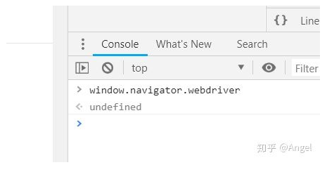

#### 1、selenium 暴露的问题

selenium在运行的时候会暴露出一些预定义的Javascript变量（特征字符串），例如"window.navigator.webdriver"，在非selenium环境下其值为undefined，而在selenium环境下，其值为true

除此之外，还有一些其它的标志性字符串(不同的浏览器可能会有所不同):

1. webdriver  
2. __driver_evaluate  
3. __webdriver_evaluate  
4. __selenium_evaluate  
5. __fxdriver_evaluate  
6. __driver_unwrapped  
7. __webdriver_unwrapped  
8. __selenium_unwrapped  
9. __fxdriver_unwrapped  
10. _Selenium_IDE_Recorder  
11. _selenium  
12. calledSelenium  
13. _WEBDRIVER_ELEM_CACHE  
14. ChromeDriverw  
15. driver-evaluate  
16. webdriver-evaluate  
17. selenium-evaluate  
18. webdriverCommand  
19. webdriver-evaluate-response  
20. __webdriverFunc  
21. __webdriver_script_fn  
22. __$webdriverAsyncExecutor  
23. __lastWatirAlert  
24. __lastWatirConfirm  
25. __lastWatirPrompt  
26. $chrome_asyncScriptInfo  
27. $cdc_asdjflasutopfhvcZLmcfl_  

